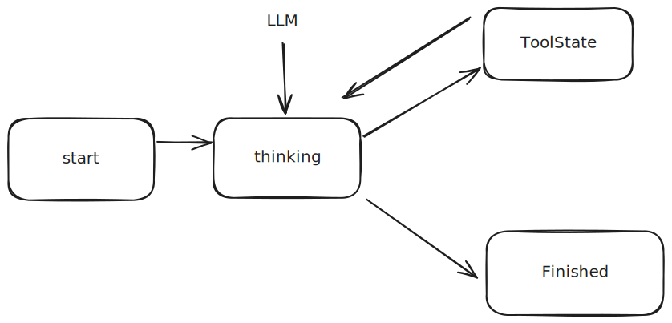

### Lesson 1

对于最近很火的Agent，为了弄清他的原理和运作方式，我将尽自己的可能为大家一步一步的从一个最小的库开始搭建成一个初步具有一定功能的Agent。首先我们需要搭建一个最小的可以运行的Agent，首先我们需要思考一个初步功能的Agent是什么？有什么功能？首先，他需要一个可以接受用户输入的功能，其次他需要发给大模型，最后他需要根据大模型的返回来决定是否终止还是继续调用工具。

基于上面的思考，我们可以抽象出如下的状态:

一开始Agent从Start的状态开始，然后转移到Thinking状态，这个状态接收LLM的输出决定下一个转移的状态，然后它有两个可以转移的方向，一个是转向Tool即采用工具调用，另一个是转移到Finish，即完成的状态，好了，弄清楚这些我们就可以开始写代码了。
首先向一下我们缺少什么需要的能力，首先我们得向Deepseek发请求并且解析，其次我们需要运行Bash脚本，所以有如下的清单
```
1. 收发Deepseek消息
2. Bash脚本
```
那么首先，我们开始构建Client,为了发送请求，其必要的参数是:
```go
type DeepSeekClient struct {
	APIKey  string
	BaseURL string
	Model   string
}
```
然后承载消息的结构体是
```go
type ChatMessage struct {
	Role       string     `json:"role"`
	Content    string     `json:"content,omitempty"`
	ToolCalls  []ToolCall `json:"tool_calls,omitempty"`
	ToolCallID string     `json:"tool_call_id,omitempty"`
	Name       string     `json:"name,omitempty"`
}

type ToolCall struct {
	ID       string       `json:"id"`
	Type     string       `json:"type"`
	Function ToolFunction `json:"function"`
}

type ToolFunction struct {
	Name      string `json:"name"`
	Arguments string `json:"arguments"`
}
```
然后是经典的和Deepseek交互的过程
```go
type ChatRequest struct {
	Model    string           `json:"model"`
	Messages []ChatMessage    `json:"messages"`
	Tools    []map[string]any `json:"tools,omitempty"`
}

type ChatResponse struct {
	Choices []struct {
		Message ChatMessage `json:"message"`
	} `json:"choices"`
}

func (c *DeepSeekClient) Chat(
	ctx context.Context,
	messages []ChatMessage,
	tools []map[string]any,
) (*ChatResponse, error) {
	reqBody := ChatRequest{
		Model:    c.Model,
		Messages: messages,
		Tools:    tools,
	}
	data, err := json.Marshal(reqBody)
	if err != nil {
		return nil, err
	}
	req, err := http.NewRequestWithContext(
		ctx,
		"POST",
		c.BaseURL+"/chat/completions",
		bytes.NewBuffer(data),
	)

	if err != nil {
		return nil, err
	}

	req.Header.Set("Authorization", "Bearer "+c.APIKey)
	req.Header.Set("Content-Type", "application/json")
	resp, err := http.DefaultClient.Do(req)
	if err != nil {
		return nil, err
	}
	defer resp.Body.Close()
	body, err := io.ReadAll(resp.Body)
	if err != nil {
		return nil, err
	}
	if resp.StatusCode >= 400 {
		return nil, fmt.Errorf("deepseek api error: %s", string(body))
	}
	var result ChatResponse
	err = json.Unmarshal(body, &result)
	if err != nil {
		return nil, err
	}
	return &result, nil
}
```
之后是Bash脚本，但考虑到之后会有更多的Tool被添加进来，所以这里需要一个抽象,所以Tool被建模成一个interface，目前先满足简单的需求，tool被定义如下
```go
// Tool的定义
type Tool interface {
	//工具的名称
	Name() string
	//工具的描述
	Description() string
	//工具的Input Schema应该是什么
	InputSchema() map[string]any
	//调用这个工具
	Call(ctx context.Context, input map[string]any) (string, error)
}
```
与之配套的还有一个抽象的注册层，所以有
```go
// 工具注册表
type Registry struct {
	Tools map[string]Tool
}

// 初始化
func NewRegistry() *Registry {
	return &Registry{
		Tools: make(map[string]Tool),
	}
}

// 注册对应的表
func (r *Registry) Register(tool Tool) error {
	name := tool.Name()
	if _, ok := r.Tools[name]; ok {
		return fmt.Errorf("%v tool has already exists", name)
	}
	r.Tools[name] = tool
	return nil
}

// 得到对应的工具
func (r *Registry) Get(name string) (Tool, bool) {
	tool, ok := r.Tools[name]
	return tool, ok
}

// 得到对应的List列表
func (r *Registry) List() []Tool {
	list := make([]Tool, 0, len(r.Tools))
	for _, tool := range r.Tools {
		list = append(list, tool)
	}
	return list
}

/*
转化成Deepseek认识的格式
[

	{
		"type" : "function",
		"function" : {
			"name" : name ,
			"description" : description,
			"parameters" : parameters
		}
	}
	..................

]
*/
func (r *Registry) ToDeepSeekFormat() []map[string]any {
	tools := make([]map[string]any, 0)
	for _, tool := range r.Tools {
		tools = append(tools, map[string]any{
			"type": "function",
			"function": map[string]any{
				"name":        tool.Name(),
				"description": tool.Description(),
				"parameters":  tool.InputSchema(),
			},
		})
	}
	return tools
}
```
好了现在可以开始写对应的Bash的实现了，对应的Bash的一般是我们在终端中输入ls,pwd,cat之类的所以可以对应
```json
{
 	"type" : "object",
   "properties" : {
		"command" : {
			"type" : "string",
           "description" : "这里请填写需要执行的Bash脚本"
		}
	},
   "required" : ["command"]
}
```
翻译成对应的代码就是
```go
package main

import (
	"bytes"
	"context"
	"fmt"
	"os/exec"
)

/*
* 这个是关于Bash的
 */

type BashTool struct{}

func (b *BashTool) Name() string {
	return "bash"
}

func (b *BashTool) Description() string {
	return "这是Bash的工具,执行和Bash有关的操作"
}

/*
* 首先对于Bash而言我的输入实际上是一个Object，然后这个Object里面有command字段，这个字段可以是需要执行的命令，
* 并且这个字段是必须的因此，我可以写下
* {
* 	"type" : "object",
*   "properties" : {
*		"command" : {
*			"type" : "string",
*           "description" : "这里请填写需要执行的Bash脚本"
*		}
*	},
*   "required" : ["command"]
* }
 */
func (b *BashTool) InputSchema() map[string]any {
	return map[string]any{
		"type": "object",
		"properties": map[string]any{
			"command": map[string]any{
				"type":        "string",
				"description": "Bash command to execute",
				"example":     []string{"ls", "cat", "tail", "pwd"},
			},
		},
		"required": []string{"command"},
	}
}

/*
* DeepSeek大概会返回
* {
*  		"command" : "echo 'Hello World'"
* }
 */
func (b *BashTool) Call(ctx context.Context, input map[string]any) (string, error) {
	//开始解析对应的命令
	command, ok := input["command"].(string)
	if !ok || command == "" {
		return "", fmt.Errorf("command is not exist or command is empty %v....", ok)
	}
	//开始命令的执行
	cmd := exec.CommandContext(ctx, "bash", "-c", command)
	var stdout bytes.Buffer
	var stderr bytes.Buffer
	cmd.Stderr = &stderr
	cmd.Stdout = &stdout
	err := cmd.Run()
	output := stdout.String()
	if stderr.Len() > 0 {
		if output != "" {
			output += "\n[STDERR]:\n" + stderr.String()
		} else {
			output = stderr.String()
		}
	}
	if output == "" && err == nil {
		output = "bash exec success"
	}
	return output, err
}
```
之后准备工作做好了，之后便可以开始对应agent的代码的构建了，按照上面的代码首先可以发现
```go
type StateName string
const (
	StartState    StateName = "start"
	ThinkingState StateName = "thinking"
	ToolState     StateName = "tool"
	FinishState             = "finish"
)
```
和其中状态转移发生的Event
```go
// 然后开始定义事件之间的转移
type Event string

// 然后定义其中的事件
const (
	EventInit             Event = "INIT"
	EventStartToThinking  Event = "START_TO_THINKING"
	EventThinkingToTool   Event = "THINKING_TO_TOOL"
	EventToolToThinking   Event = "TOOL_TO_THINKING"
	EventThinkingToFinish Event = "THINKING_TO_FINISH"
)
```

然后还有转移的结构体
```go
type Transition struct {
	From  StateName
	Event Event
	To    StateName
}
```
然后我们实现
```go
type Agent struct {
	CurrentState StateName
	Transitions  []Transition
	Handlers     map[StateName]StateHandler
	Client       *DeepSeekClient
	Registry     *Registry
	Message      []ChatMessage
}

func (a *Agent) RegisterHandler(
	h StateHandler,
) {
	a.Handlers[h.Name()] = h
}

// 然后我们实现状态转移
func (a *Agent) Transition(event Event) error {
	for _, t := range a.Transitions {
		if a.CurrentState == t.From && event == t.Event {
			a.CurrentState = t.To
			return nil
		}
	}
	return fmt.Errorf("invalid transition from %v event %v", a.CurrentState, event)
}
```
最后得到
```go
func (a *Agent) Run(ctx context.Context, userInput string) error {
	//初始化
	a.Message = append(a.Message, ChatMessage{
		Role:    "user",
		Content: userInput,
	})
	//完成初始化，进入Thinking状态
	err := a.Transition(EventStartToThinking)
	if err != nil {
		return err
	}
	//然后开始循环
	for {
		handler, ok := a.Handlers[a.CurrentState]
		if !ok {
			return fmt.Errorf(
				"handler not found: %s",
				a.CurrentState,
			)
		}
		err := handler.Execute(ctx, a)
		if err != nil {
			if errors.Is(
				err,
				ErrAgentFinished,
			) {
				return nil
			}
			return err
		}
	}
}
```