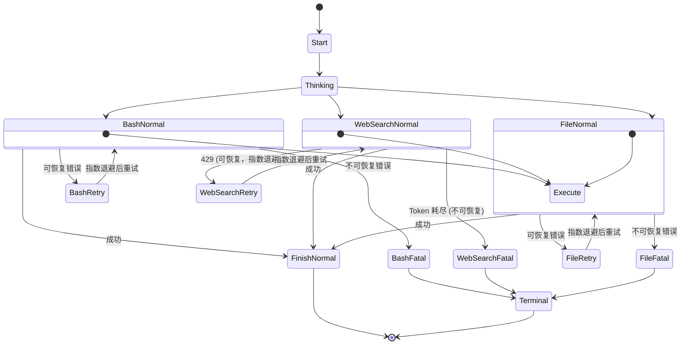

### lesson 2 尝试Graph化
好了，在lesson 1中我们尝试了定义State的方案来构建对应的Agent发现整个Agent运行的良好，但是更近一步的，如果我们需要更多的状态呢？现在只有Start,Thinking,Tool,Finish四个状态，如果之后有更多的状态呢？，就很简单的来说，例如Tool状态里面有BashTool ， FileTool ， WebSearchTool ...错误的状态有Retry和Fatal，这样状态流转就会一团乱麻，就像下面的例子显示的:



所以我们需要抽象，但是从上面的图中可以看出，随着状态的增多，实际上状态与状态之间愈发形成了一种图之间的关系，所以我们首先可以想到抽象出来两个必要的组件
```
+ Node
+ Edge
```
然后Node和Edge之间相互连接便可以形成对应的图，这里我们也继续做一个抽象graph,然后由于大模型是必须是一个无状态的，所以我们可以抽象出来一个State，最后便是将这些一起组合起来的runtime，所以说应该有如下的文件夹。
```
+ Node
+ Edge
+ State
+ Graph
+ Runtime
```

之后便是思考其如何做抽象组织起来的问题,首先，肯定是需要一个起始状态和一个终止状态，为了方便以后的其他文件的访问所以放在types.go里面
```go
type NodeID string
const (
	Start NodeID = "start"
	End NodeID = "end"
)
```


但是显然这样很是不妥，因为这样的图的话只有start和end，一运行的话就直接从start到end了，中间没有智能的切换，所以针对这样的情况，一定需要中间定义新的Node，所以便可以写出如下的接口
```go
type Node interface {
	ID() types.NodeID
	Execute(ctx context.Context , input types.Map)(types.Map,error)
}
```
好了，之后便可以搭建出lesson 1的类似的所有的节点了，但是如下图所示，你发现Node和Node之间只有孤零零的一些孤立的点，Node和Node之间的流转做不了，显然这个时候会想到定义如下的struct
```go
type Edge struct {
	From types.NodeID
	To types.NodeID
}
```
此时便可以变成如下的图，但是对于下面这张图而言，Thinking到底是走向Tool还是走向end呢？显然的单纯的定义这个边没有意义，还需要对应的条件和优先级，但是对于今天的lesson 2 而言，我们简化对应的路由条件有lesson 1得到的经典的转移条件
```
有ToolCall就转移到Tool，不然转移到Finish
```

这个时候加上新的定义:
```go
type ConditionalEdge struct {
	From types.NodeID
	ConditionFunc ConditionFunc
}
```


只要满足ConditionalFunc就转移到Tool，OK但是解决完了上面这些之后，有lesson1 可以知道，我们需要一个地方来保存我们的状态，并且就以后的lesson 中可能会添加对应的子agent，这个时候原来的朴素的更新策略就出了问题，即下面看一个经典的场景


例如一个Agent派发同一个任务给了三个子Agent，SA1说Beyonce是最好的，SA2说Taylor Swift是最好的，SA3说Ye是最好的，假如是传统的更新方式的话，这三个子agent谁是最后一个更新的谁就会把结果写入父Agent，利用如果SA1是最后得出结论的话，最后父Agent得到的就是Beyonce是最好的，但这显然是不对的，我们需要得到的是[]string{"Beyonce是最好的"，"Taylor Swift是最好的"，"Ye是最好的"},所以引入Reducer，定义
```go
type Reducer func(current any ,  update any) any
```
在更新的时候采用没有就覆盖，有就追加的方式来做
```go
func(s *Store)Patch(updater types.Map){
	for k , v := range updater {
		if reducer , exists := s.reducers[k]; exists {
			s.values[k] = reducer(s.values[k],v)
		}else{
			s.values[k] = v
		}
	}
}
```
这样便可以实现对应可以追加的操作。